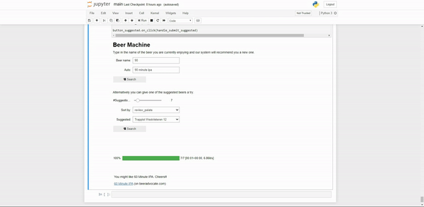
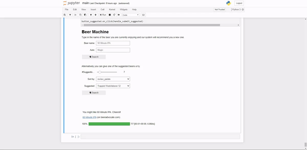

# Data Science - Final Project
The final project for the Data Science course.

The general topic is to find out something interesting about the alcohol consumption of humans. We will fix a more specific topic and hypothesis once we have an overview of available datasets.

### Beer Taste Profile

Get and idea of the taste profile of beer.

#### Dataset

1.5 Million beer reviews. A lot of info on taste profile. Breweries and name/style of beer are also given. Maybe we can expand it by location etc. Unfortunately only username given as info. We could also add gender, age, location of users (data is available on beeradvocate website).
[Beer Advocate Reviews](https://data.world/socialmediadata/beeradvocate)

##### Columns

###### Original Columns
* `brewery_id` unique id of the brewery
* `brewery_name` name of the brewery
* `beer_beerid` unique id of the beer
* `beer_name` name of the beer
* `beer_style` style of the beer
* `review_profilename` profilename of the reviewer
* `review_time` is given as a UNIX timestamp
* `review_overall` float value between 1 and 5
* `review_aroma` float value between 1 and 5
* `review_appearance` float value between 1 and 5
* `review_palate` float value between 1 and 5
* `review_taste` float value between 1 and 5
* `beer_abv` is alcohol by volume

As there were some information missing, we added some useful columns to the dataset. The added columns are country_plain, country_alpha_3, review_mean and review_count.
To get information on the country of the breweries, we wrote a script and extracted this information from the website [Beer Advocate](http://www.beeradvocate.com/). Some of the breweries are already closed (1930: USA, 18968: USA, 1953: USA, 9343: USA, 10099: USA, 3817: NZL, 1549: USA, 10097: USA, 1548: USA, 5379: USA, 5318: USA, 3257: CA, 23980: USA) so we got the information from [Wikipedia](https://www.wikipedia.org/).

###### Added Columns
* `country_plain`	country of the brewery
* `country_alpha_3`	country code of the brewery
* `review_mean`	mean value of all 5 indivitual review values
* `review_count` number of reviews for each beer

#### Questions
* Q1: How do the different ratings and the alcohol content correlate?
* Q2: What is the mean alcohol content overall?
* Q3: How does the detailed distribution of the alcohol content look like?
* Q4: Which countries produce the strongest/weakest beer?
* Q5: What is the most common beer style?
* Q6: How many different beer styles are there?
* Q7: What are the best rated beer styles?
* Q8: How do the beer styles differ in the individual ratings?
* Q9: Which breweries (>500 ratings) produce the best beer?
* Q10: What are the best breweries in each country?
* Q11: What are the best beers overall?
* Q12: How to the indivitual ratings change with the overall rating increasing?
* Q13: What is the best beer in each country?
* Q14: What is the best/worst famous (> 1000 ratings) beer?
* Q15: Which countries produce the best beer?
* Q16: What are the best/worst beers in Austria?
* Q17: What are the most famous beer in Austria (by number of ratings)?

#### Machine Learning

We tried different regression models for our dataset. The results are not that good but this is expected due to the high variance of the ratings. The best result was achieved by the Random Forest Regressor.

As a bonus task, we also implemented the "Beer Machine". It is a self-invented beer recommender system that is based on the correlation between the ratings of individual beers. Similar ratings from similar users lead to high recommendation scores.
In the small GUI, the "Beer Machine" can be tested.

